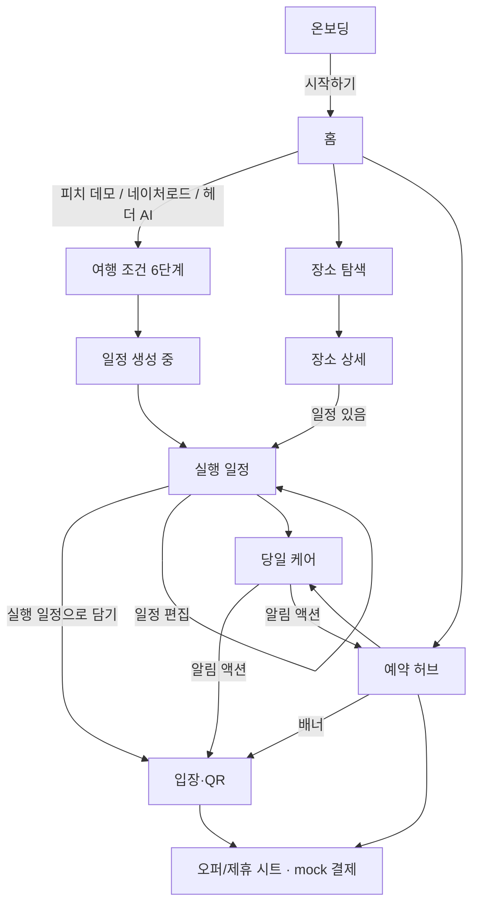

# ODRÉ GANGWON — 앱 흐름·화면 검증 가이드

> 데모·피치·QA 시 전체 화면과 사용자 여정을 빠르게 확인하기 위한 문서입니다.  
> 구현 기준: `src/components/sections/OdreTravelApp.tsx` (단일 페이지 SPA, `step` 상태 기반)

---

## 1. 로컬 실행

```bash
npm install
npm run dev
```

브라우저에서 `http://localhost:3000` 접속. 모바일 프레임(최대 약 430px) 안에서 동작합니다.

| 명령 | 용도 |
|------|------|
| `npm run dev` | 개발 서버 |
| `npm run build` | 프로덕션 빌드 검증 |
| `npm run lint` | ESLint |
| `npm run import:data` | 로컬 CSV/ZIP → JSON (음식점·상권 등) |
| `npm run refresh:tour-places` | 관광공사 장소 갱신 |
| `npm run refresh:nature-road` | 네이처로드 데이터 갱신 |

선택 환경 변수는 `.env.example` 참고. 키 없이도 **mock + 규칙 기반 AI**로 대부분의 플로우가 동작합니다.

---

## 2. 네비게이션 구조

### 2.1 화면 단계 (`Step`)

| `step` | 화면 이름 | 하단 탭 | 상단 헤더 | 뒤로가기 |
|--------|-----------|---------|-----------|----------|
| `onboarding` | 온보딩 / 브랜드 소개 | 숨김 | 숨김 | — |
| `home` | 메인 홈 | 홈 | 표시 | — |
| `places` | 장소 탐색 | 장소 | 표시 | 홈 |
| `place-detail` | 장소 상세 | (이전 탭 유지) | 숨김 | 이전 화면 |
| `trip-preferences` … `trip-result` | 일정 만들기 위저드 | 숨김 | 숨김 | 단계별 |
| `generating` | AI 일정 생성 중 (저장·네이처로드·AI 채팅 단축) | 숨김 | 숨김 | trip-preferences / 장소 |
| `itinerary` | 실행 일정 | 홈(플로팅바·마이메뉴) | 표시 | 홈 |
| `newsletter` | 오드레 노트 | 뉴스레터 | 표시 | 홈 |
| `itinerary-reservation` | 입장·QR (일정 제휴) | 홈 | 표시 | 일정 |
| `reservation` | 예약 허브 | 예약 | 표시 | 홈 |
| `care` | 당일 케어 | 케어 | 표시 | 홈 |

- `preferences`·`community` 단계는 제거됨. 일정 진입은 **`trip-preferences` 위저드**로 통일.
- 카탈로그: 초기 번들은 삼척·동해 슬라이스, hydrate 후 `loadFullGangwonCatalog()`로 전체 GW async 로드.

- 상태는 URL 라우트가 아니라 **클라이언트 `step`** 으로만 전환됩니다.
- `place-detail`은 오버레이형 전체 화면이며, 닫으면 `stepBeforeDetail`로 복귀합니다.

### 2.2 하단 탭 (`BottomNav`)

| 탭 | 라벨 | 탭 시 `step` | 비고 |
|----|------|--------------|------|
| `home` | 홈 | `home` | |
| `places` | 장소 | `places` (모드: `category`) | |
| `newsletter` | 뉴스레터 | `newsletter` | 오드레 노트·권역 큐레이션 |
| `reservation` | 예약 | `reservation` (허브, 기본 카테고리 `stay`) | 권역별 mock/live fallback |
| `care` | 케어 | `care` | |

- 실행 일정은 **하단 탭이 아님** — 홈 플로팅바·마이메뉴·케어 알림에서 진입.

**예약 UX 분리 (중요)**

- **예약 탭** → 항상 **예약 허브** (`ReservationHubScreen`). 일정에 미완료 제휴 예약이 있어도 허브가 먼저 열리고, 상단 배너로 **입장·QR** 이동.
- **일정 제휴 입장·QR** → `itinerary-reservation` (`ItineraryReservationScreen`). 일정 화면의 「예약하기」/「예약·QR 확인」 또는 허브 배너에서 진입.

### 2.3 전역 크롬

| 요소 | 노출 조건 | 동작 |
|------|-----------|------|
| `AppHeader` | 온보딩·조건·생성·장소상세 제외 | 뒤로, 홈, 검색, 마이메뉴, AI 일정 |
| `BottomNav` | 온보딩·조건·생성 제외 | 5탭 전환 |
| `ActiveTripFloatingBar` | `home` + 실행 일정 존재 | 탭 시 일정 상세로 |
| `PlaceSearchSheet` | 헤더 검색 | 장소 검색·상세 이동 |
| `MyMenuSheet` | 헤더 메뉴 | 빠른 이동·설정·찜·최근 본 곳 |
| `GangwonPassSheet` | 홈 강원패스 티저 | 혜택·관광지 허브 연결 |

---

## 3. 전체 사용자 플로우 (개요)



---

## 4. 화면별 상세 및 검증 포인트

### 4.1 온보딩 (`onboarding`)

**파일:** `src/components/onboarding/OnboardingScreen.tsx`

| 확인 항목 | 기대 동작 |
|-----------|-----------|
| 최초 방문 | 온보딩 표시 (`sessionStorage` 키 `odre-onboarded` 없음) |
| 시작하기 | 홈 이동 + `odre-onboarded` 저장 |
| 재진입 | 이미 온보딩 완료 시 홈으로 스킵 (단, `itinerary`가 store에 있으면 hydrate 후 홈) |
| 홈 하단 | 「오드래강원을 소개합니다」→ 온보딩 다시 보기 |

---

### 4.2 홈 (`home`)

**구현:** `OdreTravelApp` 내 `HomeScreen`

| 섹션 | 검증 포인트 |
|------|-------------|
| 강원 권역 (`TravelZonePicker`) | 선택 시 `preferences.zoneId` 저장. **실행 가능:** `samcheok-donghae`만. 그 외 권역은 토스트 미리보기 안내 |
| 권역 히어로 (`ZoneHeroBanner`) | 권역별 이미지/그라데이션. 비실행 권역은 안내 문구 |
| 피치 데모 배너 | CTA → 고정 조건으로 `generating` → 일정 |
| 네이처로드 카드 | 삼척·동해 실행 권역에서만 일정 조건(자차·드라이브)으로 `preferences` |
| 강원패스 티저 | 시트 오픈 → 관광지 허브 등 |
| 권역 스탬프 | `regionStampIds` 진행 UI |
| 장소 캐러셀 | 카드 탭 → 상세. 더보기 → `PlaceBrowseSheet`. 찜 시 힌트 |
| 실행 일정 있을 때 | 상단 `ActiveTripFloatingBar` (예약 상태 라벨) |

---

### 4.3 장소 (`places`)

**파일:** `src/components/travel/PlacesScreen.tsx`

| 모드 | 진입 | 검증 |
|------|------|------|
| `category` (기본) | 하단 「장소」·마이메뉴 「장소 탐색」 | `preferences.zoneId` 권역 장소만. **카테고리 칩** 가로 나열 (전체/찜 탭 없음) |
| `saved` | 마이메뉴 「찜한 곳」 | 찜 목록만 |

- 카드 탭 → `place-detail`
- 찜 토글 → `tripStore.savedPlaceIds`

---

### 4.4 장소 상세 (`place-detail`)

**파일:** `src/components/travel/PlaceDetailScreen.tsx`

| 확인 | 기대 |
|------|------|
| 뒤로 | 이전 `step` 복귀 |
| 일정 없음 + 일정에 담기 | 찜 후 `places`로 |
| 일정 있음 + 일정에 담기 | 해당 day stop 추가 후 `itinerary` |
| 예약 | `openReservationHub("attraction", placeId)` |

---

### 4.5 여행 조건 (`preferences`)

**파일:** `src/components/wizard/PreferenceWizard.tsx` — **6단계**, 하단 탭 숨김

| 단계 | 입력 |
|------|------|
| 1 | 여행 날짜, 인원 |
| 2 | 기간 (당일/1박2일 등) |
| 3 | 동행 유형 |
| 4 | 여행 목적 (강원 특화) |
| 5 | 세부 테마 |
| 6 | 이동 수단, 일정 속도 |

- 마지막 「맞춤 일정 생성」→ `generating`
- 헤더 AI 일정 / 홈 CTA도 동일 진입

---

### 4.6 일정 생성 (`generating`)

**파일:** `src/components/wizard/GeneratingScreen.tsx`

| 소스 | 완료 후 |
|------|---------|
| `preferences` | `generateExecutableItineraryFromPreferences` → `itinerary` |
| `saved` (찜 기반, 현재 UI에서 직접 진입은 제한적) | 찜 장소 + 조건으로 생성 |

- 피치 데모 시 전용 카피·조건 (`config/demoPitchScenario.ts`)
- 완료 시 `itinerary` + `itineraryDetailUnlocked: true` → `itinerary`

---

### 4.7 실행 일정 (`itinerary`)

**구현:** `OdreTravelApp` 내 `ItineraryScreen`

#### 4.7.1 저장 일정 선택 모드

- `savedItineraries.length > 0` 이고 `detailUnlocked === false` → 목록만 표시
- 카드 탭 → 일정 로드 + 상세 unlock

#### 4.7.2 일정 없음

- Empty + 「맞춤 일정 만들기」→ `preferences`

#### 4.7.3 일정 상세 (보기 모드)

| 요소 | 검증 |
|------|------|
| `RoutePreviewCard` | Kakao 지도 키 있으면 지도, 없으면 폴백 프리뷰 |
| `public-transit` | `LocalTransitRoutePanel` (시내·권역 버스, TAGO mock/실데이터) |
| `DayTabs` | 1박2일 등 multi-day |
| `ItineraryResultTimeline` | 혼잡·예약 필요·로컬 쿠폰 클레임 |
| 「실행 일정으로 담기」 | 저장 후 `itinerary-reservation` (이미 저장된 일정이면 저장 생략) |
| 「예약하기 (N)」 / 「예약·QR 확인」 | `itinerary-reservation` |
| 「일정 편집」 | 편집 모드 |

#### 4.7.4 편집 모드

- `ItineraryEditTimeline` (드래그·day 이동)
- 장소 추가 `AddPlaceSheet`
- 저장 / 취소 / 조건 수정 후 재생성

---

### 4.8 입장·QR (`itinerary-reservation`)

**파일:** `src/components/travel/ItineraryReservationScreen.tsx`

| 확인 | 기대 |
|------|------|
| 제목 | 「입장·QR」 (Partner Admission) |
| 하단 탭 하이라이트 | **일정** |
| 진행률 | `ItineraryReservationProgress` |
| 카드 | 일정에 포함된 제휴 명소만 |
| 시트 | 시간대 선택 → mock 결제 → QR 발급 (`confirmPlaceReservation`) |
| 뒤로 | `itinerary` |

---

### 4.9 예약 허브 (`reservation`)

**파일:** `src/components/travel/ReservationHubScreen.tsx`

#### 카테고리 탭 (가로 스크롤)

| ID | 라벨 | 부제 | 콘텐츠 |
|----|------|------|--------|
| `stay` | 숙소 | 호텔·펜션·리조트 | mock + (키 있으면) GW 숙박 API |
| `transport` | 교통 | **KTX·고속버스** | 시내 버스 아님 |
| `rental` | 렌트카 | 픽업·반납 일정 | mock 오퍼 |
| `dining` | 음식점 | 현지 맛집·코스 | mock + 강원 로컬 데이터 |
| `activity` | 액티비티 | 체험·레저·투어 | mock |
| `attraction` | 관광지 | 제휴 명소·입장 | 허브 제휴 장소 + 시트 |

**검증 (최근 수정)**

- [ ] 6개 탭이 **오른쪽에서 잘리지 않고** 가로 스크롤로 전부 노출
- [ ] 마지막 탭(관광지) 오른쪽 여백 확보
- [ ] 검색 (`SearchField`) 카테고리별 필터
- [ ] 일정 미완료 제휴 예약 시 상단 「입장·QR 이어하기」배너
- [ ] 하단 CTA·시트가 safe-area + 하단 네비에 가리지 않음

#### 예약 완료

- 제휴 명소: `PartnerAttractionReservationSheet` → QR
- 허브 오퍼: `ReservationOfferBookingSheet` → `hubBookings`

---

### 4.10 당일 케어 (`care`)

**구현:** `OdreTravelApp` 내 `CareScreen`

| 블록 | 검증 |
|------|------|
| 상태 카드 | 확정 예약·일정 예약 대기 건수 |
| `CareWeatherPanel` | 단기·중기 (API 키 시 실데이터) |
| `CareTransitPanel` | `public-transit` 시: 시내 경로 안내 + **KTX·고속버스 예약** → 허브 `transport` |
| `CareAlertList` | 알림 탭 시 `runCareAlertAction` (QR/일정/허브/장소 등) |
| 경로 쿠폰 보관함 | 일정 타임라인에서 클레임한 오퍼 |
| 숙소·교통 예약 | `hubBookings` 목록 |
| 입장 QR | `QRTicketCard` |
| 오늘 경로 | `RoutePreviewCard` + (대중교통 시) `LocalTransitRoutePanel` |

**교통 역할 분리**

- **일정 / 케어:** `LocalTransitRoutePanel` = 시내·권역 버스 경로 (TAGO)
- **예약 허브 · 케어 버튼:** KTX·고속버스 예약만

---

## 5. 마이메뉴·검색

### `MyMenuSheet`

| 메뉴 | 이동 |
|------|------|
| 맞춤 일정 만들기 | `preferences` |
| 내 일정 | `itinerary` (저장 목록 또는 빈 경우 조건 입력) |
| 찜한 곳 | `places` (`saved`) |
| 예약 | 예약 허브 |
| 당일 케어 | `care` |
| 최근 본 곳 | 장소 상세 |
| 로그인 | mock 카카오/네이버 (`authStore`) |

### `PlaceSearchSheet`

- 전역 장소 검색 → 상세

---

## 6. 권장 E2E 검증 시나리오

### A. 피치 데모 (약 2분, 전체 실행 루프)

1. 온보딩 → 시작하기  
2. 홈 → **「피치 데모 일정 만들기」**  
3. 생성 완료 → 일정 타임라인·지도·혼잡 표시 확인  
4. **「실행 일정으로 담기」** → 입장·QR  
5. 제휴 명소 1곳 이상: 시간대 선택 → mock 결제 → QR 카드  
6. 하단 **예약** → 허브 6카테고리 스크롤·검색·숙소/교통 mock 예약 1건  
7. **케어** → 날씨·알림·QR·오늘 경로  
8. 홈 floating bar 상태 문구 확인  

### B. 장소·찜

1. 홈 권역 캐러셀 → 상세 → 찜  
2. 하단 장소 → 카테고리 칩 전환·목록  
3. 마이메뉴 찜한 곳 → 동일 장소 노출  

### C. 일정 편집·저장

1. 일정 → 편집 → stop 삭제/추가 → 저장  
2. 「저장한 일정 선택」→ 다른 일정 로드  
3. 「새 일정 만들기」→ store 리셋 후 홈  

### D. 예약 UX 분리

1. 하단 **예약** → 허브 먼저 (입장·QR 탭이 아님)  
2. 미완료 제휴 예약 시 배너 → 입장·QR  
3. 일정 탭 하이라이트: 허브=`예약`, 입장·QR=`일정`  

### E. 대중교통 분기

1. 조건 6단계에서 **대중교통** 선택 후 일정 생성  
2. 일정·케어에 `LocalTransitRoutePanel` 노출  
3. 케어에서 KTX·고속버스 → 허브 교통 탭  

### F. 비-MVP 권역

1. 홈에서 강릉·춘천 등 미실행 권역 선택 → 토스트  
2. 콘텐츠 미리보기 vs 실행 불가 문구  

---

## 7. 상태 저장 (`tripStore`)

Zustand + persist (localStorage). 주요 필드:

| 필드 | 용도 |
|------|------|
| `preferences` | 권역·날짜·이동·테마 등 |
| `itinerary` | 현재 실행 일정 |
| `savedItineraries` | 저장 목록 |
| `savedPlaceIds` | 찜 |
| `reservations` | 제휴 명소 예약·결제 |
| `hubBookings` | 허브 오퍼 예약 |
| `qrTickets` | QR 티켓 |
| `selectedSlotByPlace` | 시간대 선택 |
| `careAlerts` | 케어 알림 시드 |
| `regionStampIds` | 권역 스탬프 |
| `claimedLocalOfferIds` | 로컬 쿠폰 |

**초기화:** 일정 화면 「새 일정 만들기」→ `resetTrip()`  
**온보딩만 리셋:** `sessionStorage` `odre-onboarded` 삭제 또는 홈 「오드래강원을 소개합니다」

---

## 8. 외부 연동 (선택)

| 변수 | 영향 |
|------|------|
| `NEXT_PUBLIC_KAKAO_MAP_APP_KEY` | 일정/케어 지도 SDK |
| `KAKAO_REST_API_KEY` | 장소 좌표 보정 |
| `TOUR_API_SERVICE_KEY` / `GANGWON_OPEN_API_KEY` | 숙박·음식점 등 |
| `WEATHER_API_SERVICE_KEY` | 케어 날씨 |
| `TAGO_SERVICE_KEY` | 시내 버스 도착 |
| `OPENAI_API_KEY` / `GEMINI_API_KEY` | AI 일정 (없으면 규칙 fallback) |

---

## 9. 알려진 제한·주의

- **단일 URL:** `/` 만 사용. 딥링크·브라우저 뒤로가기로 step 복원 없음.
- **MVP 실행 권역:** 삼척·동해 (`samcheok-donghae`). 다른 권역은 UI 미리보기 위주.
- **결제:** 전부 mock. 실제 PG·재고 없음.
- **혼잡·QR:** 별도 하단 탭 없음. 일정 카드·예약·케어에 통합.
- **부모 스크롤:** 메인 영역 `overflow-x-hidden` — 가로 스크롤 UI(예약 카테고리 탭)는 **자체 `overflow-x-auto` 컨테이너** 필수.
- **찜만으로 일정 생성:** `generatingSource: "saved"` 경로는 코드에 존재하나, 현재 UI에서 「찜 일정 만들기」 CTA는 제거됨.

---

## 10. 빠른 체크리스트 (릴리스 전)

- [ ] `npm run build` 성공  
- [ ] 온보딩 → 홈 → 피치 데모 → 일정 → 입장·QR → 허브 → 케어  
- [ ] 예약 허브 6탭 가로 스크롤·잘림 없음  
- [ ] 교통 탭 부제 `KTX·고속버스` (시내 버스 문구 없음)  
- [ ] 예약 탭 = 허브, 입장·QR = 일정 탭 활성  
- [ ] 장소: 카테고리 칩·권역 필터·찜  
- [ ] 대중교통 선택 시 시내 패널 + 허브 교통 분리  
- [ ] 하단 버튼·시트 safe-area 여백  
- [ ] Kakao 키 없을 때 지도 폴백 정상  

---

*문서 버전: 코드베이스 기준 2026-05-22. 구현 변경 시 `OdreTravelApp.tsx`의 `Step`·`handleBottomNav`·`openReservationHub`를 우선 갱신하세요.*
